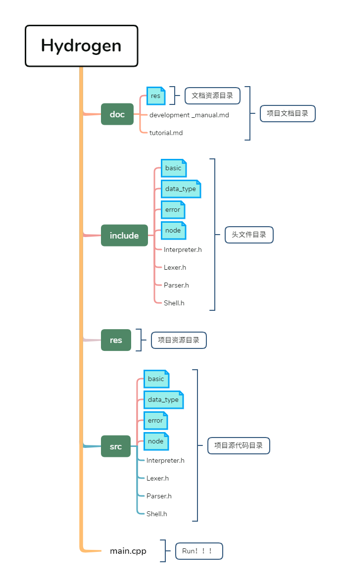

# 海琛开发者手册

---

## 基础数据类型

- int
- float

- String
  - 不区分字符串类型和字符类型，统一是字符串类型

## 上下文无关文法

```CFG
expr        : identifier eq expr
            : comp-expr ("and"|"or" comp-expr)*

comp-expr   : "not" comp-expr
            : arith-expr (ee|gt|lt|gte|lte arith-expr)*

arith-expr  : term (plus|minus term)* 

term        : factor (mul|div factor)*

factor      : power (pow factor)*

power       : identifier|int|float
            : (plus|minus) power
            : lparen expr rparen
            : if-expr
            : for-expr
            : while-expr

if-expr     : expr "if" expr (else expr)?
            : "if" expr colon expr 
              ("elif" expr colon expr)*
              ("else" expr)?

for-expr    : "for" identifier (from int)? to int (step int)? colon expr

while-expr  : "while" expr colon expr
```

## 项目目录结构


