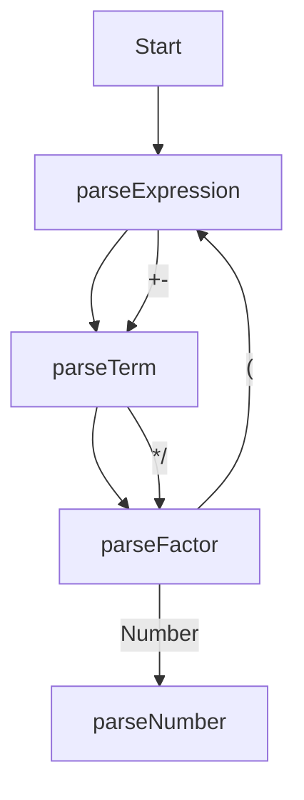

```
statements  : (EL* expr?)* EF|RBRACE

expr        : identifier eq expr
            : comp-expr ("and"|"or" comp-expr)*

comp-expr   : "not" comp-expr
            : arith-expr (ee|gt|lt|gte|lte arith-expr)*

arith-expr  : term (plus|minus term)*

term        : factor (mul|div|mod factor)*

factor      : (plus|minus) factor
            : power

power       : call (pow factor)*

call        : atom (LPAREN (expr (COMMA expr)*)? RPAREN)?
		    : atom (LBRACKET (expr (COMMA expr)*)? RBRACKET)?

atom        : identifier|int|float|string
            : lparen expr rparen
            : if-expr
            : for-expr
            : while-expr
            : func-expr
            : return-expr
            : "break"
            : "continue"

if-expr     : expr "if" expr (else core)?
            : "if" expr core
              ("elif" expr core)*
              ("else" core)?

for-expr    : "for" identifier
              (from int)?
              to int
              (step int)?
              core

while-expr  : "while" expr core

func-expr   : "function" identifier
              lparen
                  (identifier (eq expr)?
                      (comma identifier (eq expr)?)*
                  )?
              rparen
              core

return-expr : "return" expr

core       : (colon expr) | (lbrace statements rbrace)
```

## 一、文法

海琛语言的文法采用扩展的 Backus 范式（EBNF，Extended Backus-Naur Form）表示，其中：

- 符号 `[...]` 表示括号内包含的内容是可选项；
- 符号 `{...}` 表示括号内包含的内容是可重复 0 次或多次的项；
- 全大写的记号是**终结符**

表达式




```ebnf
ArithExpr : Term ('+' | '-' Term)*
Term      : Factor ('*' | '/' Factor)*
Factor    : IntConst
          : '(' ArithExpr ')'
```

## 二、终结符

#### 0. CharType

这里定义了各种字符类型，对应于程序中的枚举类：`CharType`

```ebnf
LOWERCASE  ::= 'a' | 'b' | ... | 'z'
UPPERCASE  ::= 'A' | 'B' | ... | 'Z'
HEX_DIGIT  ::= DIGIT | 
               'a'   | ... | 'f' | 
               'A'   | ... | 'F'
DIGIT      ::= '0' | '1' | ... | '9'
UNDERLINE  ::= '_'
BLANK      ::= ' '
OPERATOR_C ::= '>' | '<' | '=' | '&' | '|' | 
			  '+' | '-' | '*' | '/' | '^' |
			  '!' |
QUOT_C     ::= '"'
```


#### 1. 关键字 `KEYWORD`

```ebnf
KEYWORD ::= 'if'       | 'elif' | 'else' |
            'while'    |
            'function'
```

#### 2. 标识符 `IDENT`

```ebnf
IDENT ::= (LOWERCASE | UPPERCASE | '_') (LOWERCASE | UPPERCASE | DIGIT | '_')*
```

#### 3. 数值常量 `INT_CONST` `FLOAT_CONST`

```ebnf
INT_CONST   ::= ('+' | '-')? DIGIT+                 # 十进制
              | ('+' | '-')? '0x' HEX_DIGIT+        # 十六进制
              | ('+' | '-')? '0b' ('0' | 'b')+      # 二进制
FLOAT_CONST ::= ('+' | '-')? DIGIT+ '.' DIGIT+
```

#### 4. 字符串常量 `STR_CONST`

```ebnf
STR_CONST ::= '"' 任意字符 '"'
```
**注意：这里没有考虑转义的情况。**


#### 5. 运算符 `OPERATOR_T`

```ebnf
OPERATOR ::= '+'  | '-'  | '*'  | '/'  | '^'  |
             '+=' | '-=' | '*=' | '/=' |
             '<'  | '<=' | '>'  | '>=' | '==' |
             '&&' | '||' | '!'
```

#### 6. 括号 `BRACKET_T`

```ebnf
BRACKET_C ::= '(' | ')' |
            '[' | ']' | 
            '{' | '}'
```

#### 7. 结束符 `END`

```ebnf
END ::= ''
```
