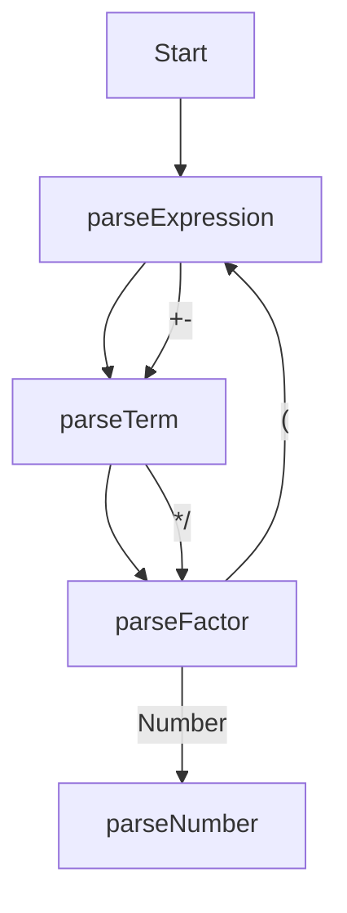

```
statements  : (EL* expr?)* EF|RBRACE

expr        : identifier eq expr
            : comp-expr ("and"|"or" comp-expr)*

comp-expr   : "not" comp-expr
            : arith-expr (ee|gt|lt|gte|lte arith-expr)*

arith-expr  : term (plus|minus term)*

term        : factor (mul|div|mod factor)*

factor      : (plus|minus) factor
            : power

power       : call (pow factor)*

call        : atom (LPAREN (expr (COMMA expr)*)? RPAREN)?
		    : atom (LBRACKET (expr (COMMA expr)*)? RBRACKET)?

atom        : identifier|int|float|string
            : lparen expr rparen
            : if-expr
            : for-expr
            : while-expr
            : func-expr
            : return-expr
            : "break"
            : "continue"

if-expr     : expr "if" expr (else core)?
            : "if" expr core
              ("elif" expr core)*
              ("else" core)?

for-expr    : "for" identifier
              (from int)?
              to int
              (step int)?
              core

while-expr  : "while" expr core

func-expr   : "function" identifier
              lparen
                  (identifier (eq expr)?
                      (comma identifier (eq expr)?)*
                  )?
              rparen
              core

return-expr : "return" expr

core       : (colon expr) | (lbrace statements rbrace)
```

## 一、文法

海琛语言的文法采用扩展的 Backus 范式（EBNF，Extended Backus-Naur Form）表示，其中：

- 符号 `[...]` 表示括号内包含的内容是可选项；
- 符号 `{...}` 表示括号内包含的内容是可重复 0 次或多次的项；
- **终结符**：全大写的记号、由单引号 `'` 包含的字符串；

表达式




```C
END : '\n' | '\r' | 'EOF' | ';'

// 执行单元
ExeUnit   : {Stmt | Def}
LoopUnit  : {LoopStmt}

// 语句（一般指可修改自动机状态的代码。譬如 IfStmt，它可以修改状态机接下来要执行的语句，对于 AssignStmt 而言，则会往状态机中新增一个变量）
LoopStmt  : 'break' END
          | 'continue' END
          | Stmt
Stmt      : IfStmt
          | WhileStmt
          | AssignStmt
          | 'return' [Expr] END
          | Expr END
IfStmt    : 'if' Expr '{' ExeUnit '}'
            {'elif' Expr '{' ExeUnit '}'}
            ['else' '{' ExeUnit '}']
WhileStmt : 'while' Expr '{' LoopUnit '}'
AssignStmt: IDENT ['=' (Expr | Array)] END
Array     : '[' {Expr ','} ']'


// 定义（与语句相比，它本身不修改状态机的状态，它只告诉自动机，要怎么修改状态机）
Def       : FuncDef
FuncDef   : 'def'  IDENT '(' [Params] ')' '{' ExeUnit '}'
Params    : IDENT {',' IDENT}


// 表达式
Expr      : LogicExpr

LogicExpr : ('not' LogicExpr)
          | (CompExpr {('and' | 'or') CompExpr}) 
CompExpr  : ArithExpr {('>' | '<' | '>=' | '<=' | '==') ArithExpr}

ArithExpr : Term {('+' | '-') Term}
Term      : Factor {('*' | '/') Factor}
Factor    : {'+' | '-'} Power
Power     : Primary {'^' Power}
Primary   : INT_CONST
          | FLOAT_CONST
          | STR_CONST
          | Call
          | IDENT
          | '(' Expr ')'
Call      : (IDENT '(' Expr {',' Expr} ')' )
          | (IDENT '[' Expr {',' Expr} ']')
```

案例代码

```hdg
def fun(a, b){
    return a + b;
}


def Pig{
    def init(num, other){
        return 
    }
    return a + b;
}

# 
# 
# 

state My{

}
```

函数与对象合并在一起？

状态机是个对象，当我们调用它时，就会执行里面的语句。
状态机里的语句分为两种：产生新的对象；修改已有对象的值。
如果你想要产生新的对象，你要遵循下面的语法：

```hdg
State    : [Assign | Stmt]

# 修改已有的对象
Stmt      : LoopStmt
LoopStmt  : 'break' END
          | 'continue' END
          | BaseStmt
BaseStmt  : IfStmt
          | WhileStmt
          | AssignStmt
          | 'return' [Expr] END
          | Expr END
IfStmt    : 'if' Expr '{' ExeUnit '}'
            {'elif' Expr '{' ExeUnit '}'}
            ['else' '{' ExeUnit '}']
WhileStmt : 'while' Expr '{' LoopUnit '}'

# 产生新的对象
Assign      : StateAssign
            | ValAssign

## 状态机
StateAssign : 'def' IDENT ['(' [Params] ')'] '{' State '}'
Params      : IDENT {',' IDENT}

## 表达式对象
ValAssign   : 'val' IDENT "=" Expr END
Expr      : LogicExpr

LogicExpr : ('not' LogicExpr)
          | (CompExpr {('and' | 'or') CompExpr}) 
CompExpr  : ArithExpr {('>' | '<' | '>=' | '<=' | '==') ArithExpr}

ArithExpr : Term {('+' | '-') Term}
Term      : Factor {('*' | '/') Factor}
Factor    : {'+' | '-'} Power
Power     : Primary {'^' Power}
Primary   : INT_CONST
          | FLOAT_CONST
          | STR_CONST
          | Call
          | IDENT
          | '(' Expr ')'
Call      : (IDENT '(' Expr {',' Expr} ')' )
          | (IDENT '[' Expr {',' Expr} ']')
```

```hdg
def Compile{
    a = 1
    b = 2
    c = 0

    def add(){
        c = a + b
    }
    def sub(){
        c = b - a
    }

    add();
}

Compile()
println(Compile.c) // 输出为 3

Compile.sub()
println(Compile.c) // 输出为 1
```

```hdg
def Compile{
    a = 1
    b = 2
    c = 0

    def add(){
        c = a + b
    }
    def sub(){
        c = b - a
    }

    add();
}

Compile[0:3]()
println(Compile.c) // 输出为 0

Compile[3:6]()
println(Compile.c) // 输出为 3
```

```hdg
def Compile{
    a = 1
    b = 2
    c = 0
}

Compile()
println(Compile.c) // 输出为 0

Compile[3].insert{
    def add(){
        c = a + b
    }

    add()
}

Compile()
println(Compile.c) // 输出为 3
```

```
def Compile{
    a = 1
    b = 2
    c = 0
    if (a > 1){
        c = a + b
    }
    else {
        c = a - b
    }
}
Compile[3]
```

```
def Animal{
    a = 1
    b = 2
    c = 0
    if (a > 1){
        c = a + b
    }
    else {
        c = a - b
    }
}

Animal2 = copy(Animal)

Compile()
println()
```


## 二、终结符

#### 0. CharType

这里定义了各种字符类型，对应于程序中的枚举类：`CharType`

```ebnf
DIGIT      ::= '0' | '1' | ... | '9'
HEX_DIGIT  ::= DIGIT | 
               'a'   | ... | 'f' | 
               'A'   | ... | 'F'
LOWERCASE  ::= 'a' | 'b' | ... | 'z'
UPPERCASE  ::= 'A' | 'B' | ... | 'Z'
UNDERLINE  ::= '_'
BLANK      ::= ' ' | '\t'
OPERATOR_C ::= '>' | '<' | '=' | '&' | '|' | 
			   '+' | '-' | '*' | '/' | '^' |
			   '!' | '%'
QUOTE      ::= '"' | '''
DOT        ::= '.' | ','
END        ::= ';' | '\n' | 'EOF'
OTHER      ::= 其他任意字符

LETTER     ::= 'a' | 'b' | ... | 'z' |
               'A' | 'B' | ... | 'Z' | '_'
DIGIT      ::= '0' | '1' | ... | '9'
BLANK      ::= ' ' | '\t'
OPERATOR   ::= '>' | '<' | '=' | '&' | '|' | 
			   '+' | '-' | '*' | '/' | '^' |
			   '!' | '%'
QUOTE      ::= '"' | '''
DOT        ::= '.' | ','
END        ::= ';' | '\n' | 'EOF'
OTHER      ::= 其他任意字符
```


#### 1. 关键字 `KEYWORD`

```ebnf
KEYWORD ::= 'if'       | 'elif' | 'else' |
            'while'    |
            'function'
```

#### 2. 标识符 `IDENT`

```ebnf
IDENT ::= (LOWERCASE | UPPERCASE | '_') (LOWERCASE | UPPERCASE | DIGIT | '_')*
```

#### 3. 数值常量 `INT_CONST` `FLOAT_CONST`

```ebnf
INT_CONST   ::= ('+' | '-')? DIGIT+
FLOAT_CONST ::= ('+' | '-')? DIGIT+ '.' DIGIT+
```

#### 4. 字符串常量 `STR_CONST`

```ebnf
STR_CONST ::= '"' 任意字符 '"'
```
**注意：这里没有考虑转义的情况。**


#### 5. 运算符 `OPERATOR_T`

```ebnf
OPERATOR : '+'  | '-'  | '*'  | '/'  | '^'
         | '+=' | '-=' | '*=' | '/='
         | '<'  | '<=' | '>'  | '>=' | '=='
         | '&&' | '||' | '!'
```

#### 6. 括号 `BRACKET_T`

```ebnf
BRACKET_C : '(' | ')'
          | '[' | ']' 
          | '{' | '}'
```

#### 7. 结束符 `END`

```ebnf
END ::= '\n' | '\r' | 'EOF' | ';'
```
