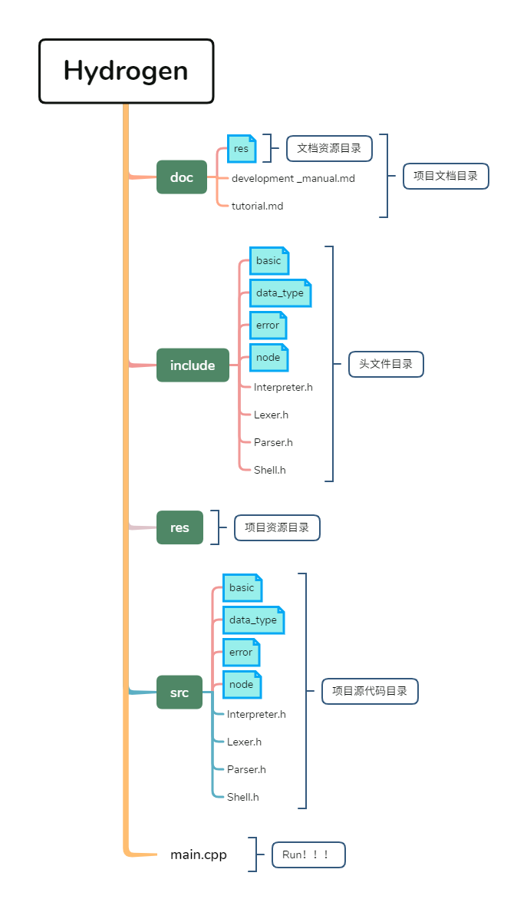

# 海琛开发者手册

---

## 基础数据类型

- int
- float

- String
  - 不区分字符串类型和字符类型，统一是字符串类型

## 字符记号表

| 词法单元     | 模式    | 词素            | 备注                   |
| ------------ | ------- | --------------- | ---------------------- |
| `INT`        | int     | int             |                        |
| `FLOAT`      | float   | float           |                        |
| `STRING`     | "char*" | "Hello World!"  | 有无数满足模式的字符串 |
| `IDENTIFIER` | char*   | "add"           |                        |
| `KEYWORD`    | char*   | "if", "while"等 | 详见关键字列表         |
|              |         |                 |                        |
| `NE`         |         | !=              |                        |
| `EE`         |         | ==              |                        |
| `GT`         |         | >               |                        |
| `LT`         |         | <               |                        |
| `GTE`        |         | >=              |                        |
| `LTE`        |         | <=              |                        |
|              |         |                 |                        |
| `PLUS`       |         | +               |                        |
| `MINUS`      |         | -               |                        |
| `MUL`        |         | *               |                        |
| `DIV`        |         | /               |                        |
| `POW`        |         | ^               |                        |
|              |         |                 |                        |
| `LPAREN`     |         | (               |                        |
| `RPAREN`     |         | )               |                        |
| `LBRACKET`   |         | [               |                        |
| `RBRACKET`   |         | ]               |                        |
| `LBRACCE`    |         | {               |                        |
| `RBRACE`     |         | }               |                        |
| `EQ`         |         | =               |                        |
|              |         |                 |                        |
| `COLON`      |         | :               |                        |
| `COMMA`      |         | ,               |                        |
|              |         |                 |                        |
| `EF`         |         | end of file     |                        |
| `EL`         |         | ";", "\n"       |                        |


## 关键字列表

| 关键字     | 备注 |
| ---------- | ---- |
| `not`      |      |
| `and`      |      |
| `or`       |      |
| `if`       |      |
| `elif`     |      |
| `else`     |      |
| `for`      |      |
| `from`     |      |
| `to`       |      |
| `step`     |      |
| `while`    |      |
| `function` |      |


## 上下文无关文法

```CFG

expr        : EL* identifier eq expr
            : EL* comp-expr ("and"|"or" comp-expr)*

comp-expr   : "not" comp-expr
            : arith-expr (ee|gt|lt|gte|lte arith-expr)*

arith-expr  : term (plus|minus term)* 

term        : factor (mul|div|mod factor)*

factor      : (plus|minus) factor
            : power

power       : call (pow factor)*

call        : atom (LPAREN (expr (COMMA expr)*)? RPAREN)?

atom        : identifier|int|float|string
            : lparen expr rparen
            : if-expr
            : for-expr
            : while-expr
            : func-expr

if-expr     : expr "if" expr (else expr)?
            : "if" expr colon expr 
              ("elif" expr colon expr)*
              ("else" expr)?
            : "if" lparen expr rparen
              

for-expr    : "for" identifier (from int)? to int (step int)? colon expr

while-expr  : "while" expr colon expr

func-expr   : "function" identifier 
              lparen 
                  (identifier (eq expr)? 
                      (comma identifier (eq expr)?)*
                  )?
              rparen
              ((colon expr) | statements)
              
statements  : lbrace EL* expr (EL* expr?)* rbrace
```

function add(a, b): a+b
add(1, 2)

for i=1 to 3: print(i)


```Hydrogen
function add(a, b): a + b
```

```error
"D:\HaaaaaalloMg\Workplace\Hydrogen\hdg\test\factorial.hdg" in module <global> :
        1 | function div(a, b): a/b
          |                       ^
"D:\HaaaaaalloMg\Workplace\Hydrogen\hdg\test\factorial.hdg" in module <div> :
    RunTimeError: Divition by zero.
        2 | div(1, 0)
          |        ^
```

## 项目目录结构


